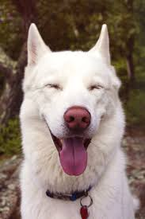

<!DOCTYPE html>
<html lang="en">
<head>
<title>Assessment 2</title>
<meta charset="utf-8">
<link href="css.css" type="text/css" rel="stylesheet">
</head>

<body>

  <header>
    <h1>Xiaoru Wang ANGELA</h1>
  </header>

<nav>
    <ul>
	 <li><a href="index.html">Home</a></li>
     <li><a href="rooms.html">Menu</a></li>
     <li><a href="directions.html">Directions</a></li>
     <li><a href="contact.html">Contact</a></li>
	</ul> 
   </nav> 
  <main>
  
	<h2>Step One</h2>
    
Determine the niche market you're trying to reach. Do you sell treats and goods to a wide variety of animals? Do you offer hands-on training or grooming services for dogs? 

    <h2>Step Two</h2>
    
Develop a flier that highlights your key services. Make clear the things that set you apart from other pet stores in your area. 

  	<h2>Step Three</h2>
    
Place an ad in your local newspaper or on a local radio station. Again, highlight the qualities that set you apart from other pet stores. 

    <h2>Step Four</h2>
	
Host an in-store event for area pet owners. You can give away a basket of pet goodies and offer to donate a portion of proceeds from sales to a local animal shelter. Offer snacks and games, and invite local newspapers, radio and television stations to come.

    </main>
    <footer>Copyright &copy; 2016
    </footer>

</body>
</html>
